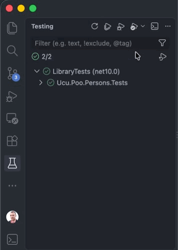

<!-- markdownlint-disable-next-line MD033 MD041 -->

# Universidad Católica del Uruguay

## Programación II

# Debug &amp; Test

Código de ejemplo del tema debug &amp; test.

Este ejemplo usa la clase `Person` que ya conoces de ejercicios anteriores. La tarea
consiste en agregar casos de prueba para verificar que no se pueda asignar
cédulas inválidas; y que se puedan asignar cuando sean válidas.

Agreguen todas las pruebas que consideren necesarias
[aquí](./test/LibraryTests/PersonTests.cs).

> [!TIP]
>
> Puedes ver qué métodos -y qué casos- te faltan probar ejecutando los test a la
> vez que mides la cobertura:
>
> 
>
> Puedes obtener más información sobre cobertura en Visual Studio Code
> [aquí](https://code.visualstudio.com/docs/debugtest/testing#_test-coverage).

Usen para los métodos de prueba la siguiente convención:

* Para las propiedades: `[Property]\_When[Case]\_[Result]`, donde `[Property]`
  se reemplaza por la propiedad a probar, `[Case]` se reemplaza por `Set` si no
  es ningún caso particular o por una descripción del caso que se está probando,
  y `[Result]` se reemplaza por el resultado esperado.

  Por ejemplo, la propiedad `Name` tiene casos de prueba
  `Name_WhenSet_UpdatesValue`, que prueba cuando se asigna un valor
  efectivamente quede asignado; y `Name_WhenNullOrEmpty_DoesNotUpdateValue`, que
  prueba cuando se asigna `null` o una cadena vacía el valor de la propiedad no
  cambie —no son valor válidos para el nombre—.

* Para los métodos: `[Method]\_When[Case]\_[Result]`, donde `[Método]` se
  reemplaza por el nombre del método a probar, `[Case]` se reemplaza por una
  descripción del caso que se está probando, y `[Result]` se reemplaza por el
  resultado esperado.

  Por ejemplo, el método `IntroduceTo` tiene un método de prueba
  `IntroduceTo_WhenValidNameAndId_WritesNameAndIdToConsole` que prueba que
  cuando se invoca con un nombre y cédula válidos, los escribe en la consola. En
  este ejemplo la clase imprime en la consola, pero no es habitual que las
  clases de dominio escriban a la consola. Una de las razones es que el código
  es más difícil de probar, vean en ese método cómo se hace.

## Uso de 

Es posible usar GitHub Copilot en este repositorio. Consulta [cómo usar Copilot
para aprender](./COPILOT.md).
